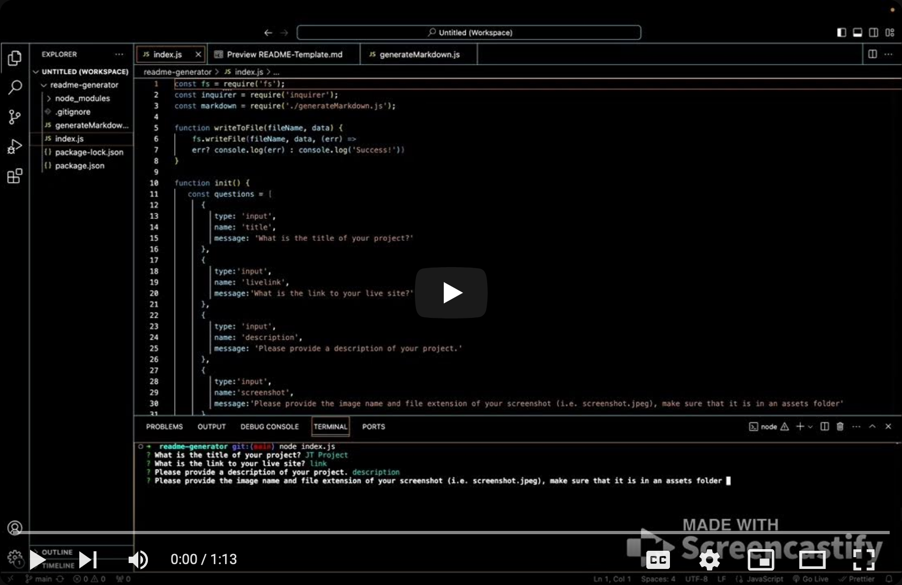

# README Generator

This application serves as a straightforward README file generator designed to produce professional README files for your projects. The user interacts with the program through a series of console-based questions that capture project details. The development of this application was an educational exercise aimed at gaining familiarity with running JavaScript applications in Node.js. It involved utilizing key Node.js modules, including the FS (file system) and inquirer modules. Additionally, this project marked my initial experience with implementing modularization across two distinct JavaScript files.

## Installation

Just clone the repository into your local repository and then run `npm install` to install the inquirer package.

## How To Use

Click the video below to watch how to use.

Upon navigating to the repository directory, enter node index.js in the console and respond to the prompts. Upon completion, a README-Template.md file will be created, allowing you to copy and paste it into any project where you wish to utilize it. Any prompts left blank will be omitted.

## Credits

For this project, I used [Inquirer](https://www.npmjs.com/package/inquirer), as well as some starter code provided by my bootcamp that can be found [here](https://github.com/coding-boot-camp/potential-enigma)

Licensed by [MIT](https://opensource.org/licenses/MIT)